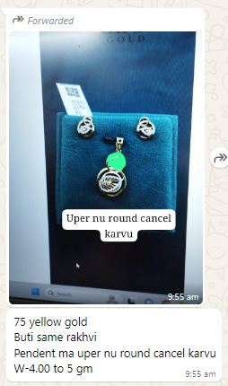
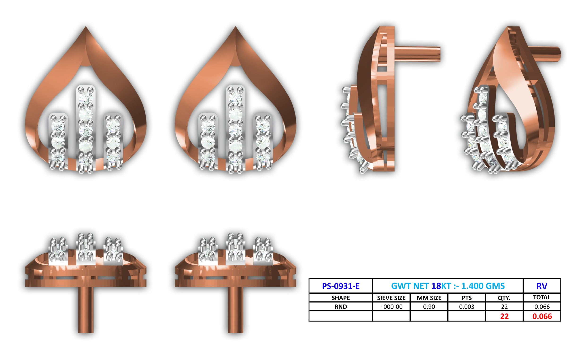
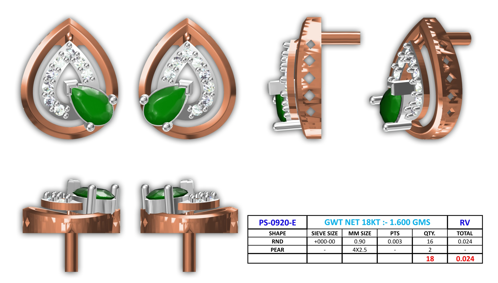
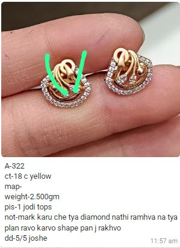
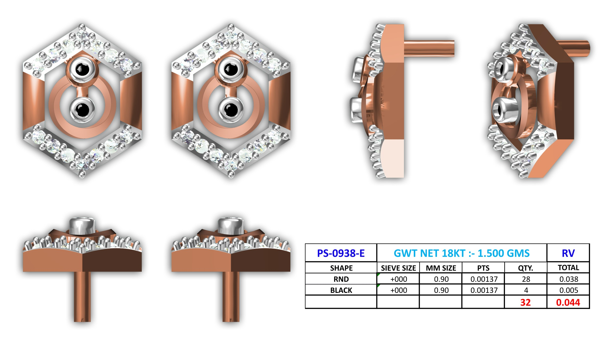
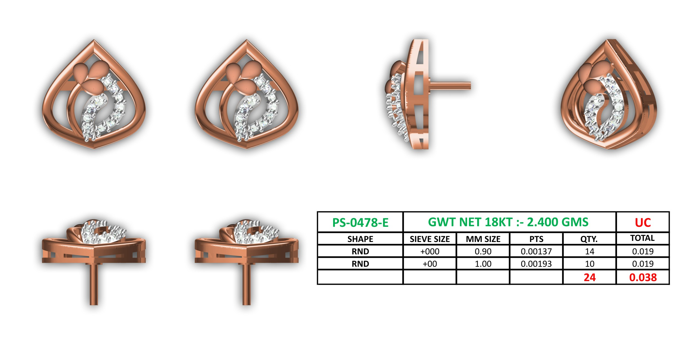

# Forensic Analysis: Failed Benchmark Queries

This report investigates why the retrieval pipeline (using SigLIP) failed to return the expected CAD designs at Rank 1 for two specific benchmark queries.

---

## Query 1: `PS-0359-O1-REF (1).JPG`

### Visual Comparison

<table>
  <tr>
    <th width="33%">Query Image</th>
    <th width="33%">Expected CAD (PS-0931-E)</th>
    <th width="33%">Returned CAD (PS-0920-E)</th>
  </tr>
  <tr>
    <td></td>
    <td></td>
    <td></td>
  </tr>
</table>

### Forensic Analysis: Why did SigLIP rank the wrong design higher?

1. **Adversarial Drawing (The Green Blob)**
   The query image is a screenshot of a WhatsApp conversation where the user has hand-drawn a prominent, bright green blob over the top loop of the pendant. SigLIP operates heavily on color distribution and global visual context. It saw the bright green blob and confidently matched it with the **prominent green pear-shaped gemstone** present in the Returned CAD. 

2. **Ground Truth Mismatch (Corrupt Benchmark)**
   The expected CAD (`PS-0931-E`) is a teardrop-shaped rose-gold earring with vertical diamond bars. This bears absolutely **zero visual, geometric, or structural resemblance** to the query image, which depicts a round pendant featuring a leaf motif. SigLIP correctly assigned a low similarity score to the expected CAD because they are completely different designs. 

**Failure Category:** Ground Truth Error / Adversarial Preprocessing (User Markup).

---

## Query 2: `PS-0490-E-O-REF.JPG`

### Visual Comparison

<table>
  <tr>
    <th width="33%">Query Image</th>
    <th width="33%">Expected CAD (PS-0938-E)</th>
    <th width="33%">Returned CAD (PS-0478-E)</th>
  </tr>
  <tr>
    <td></td>
    <td></td>
    <td></td>
  </tr>
</table>

### Forensic Analysis: Why did SigLIP rank the wrong design higher?

1. **Ground Truth Mismatch (Corrupt Benchmark)**
   Similar to Query 1, the benchmark mapping is incorrect. The query image (`PS-0490-E`) shows a semi-circular earring with swooping inner lines. The Expected CAD (`PS-0938-E`) is a **hexagon** with two round inner structures. They are entirely different geometries.

2. **Adversarial Drawing (The Green "V")**
   The query image contains a large, hand-drawn bright green "V" shape. While the Returned CAD does not have green gemstones, it *does* have a sharp teardrop shape (a "V" shape at the bottom) and an inner diamond swoop. SigLIP likely confused the geometric structure of the drawn green "V" with the outer teardrop silhouette of the Returned CAD.

3. **Heavy Occlusion (Fingers)**
   The query image features massive occlusion (fingers holding the earrings), which severely disrupts global-pooling models like SigLIP. The model is forced to match the few visible geometric lines (the drawn "V" and the swoops) rather than the actual shape of the earring.

**Failure Category:** Ground Truth Error / Adversarial Preprocessing (User Markup) / Heavy Occlusion.

---

### Conclusion

The primary reason these searches "failed" is not the AI model, but **corrupt benchmark ground truths**. In both cases, the Expected CAD mathematically and visually does not match the Query Image.

Secondary to this, the presence of **brightly colored WhatsApp markup (drawings/text)** acts as adversarial noise. SigLIP strongly indexes these drawings, matching drawn green blobs to green gemstones, and drawn "V" shapes to teardrop borders. 

To resolve this, the benchmark dataset mapping must be audited, and a robust background-removal or segmentation model (like IS-Net) must perfectly strip out user markups before inference.

## 2. Failed Query 3: PS-0359-O1-REF / q3_query.jpeg

This failure occurred in the Semantic-Only baseline where the correct CAD was ranked #2 instead of #1, losing by an incredibly thin margin of 0.0017.

### Visual Comparison

| Q3 Query Image | Rank 1 (Incorrect: ER-0494.JPG) | Rank 2 (Correct: q3_expected.jpeg) |
|:---:|:---:|:---:|
|  |  |  |

### Similarity Scores (Semantic)
- **Rank 1 (Incorrect)**: `0.7455`
- **Rank 2 (Expected)**: `0.7438`
- **Margin**: `0.0017`

### Forensic Analysis: Why SigLIP failed

The expected CAD (`q3_expected.jpeg`) features a clean, closed teardrop frame containing a sweeping diamond path and a three-leaf cluster. However, several factors caused SigLIP to incorrectly rank `ER-0494.JPG` slightly higher:

1. **Perspective Distortion**: The query image was photographed from a monitor at a steep angle. This perspective foreshortens the teardrop shape, flattening the bottom point and making the outer frame look like overlapping, looping ribbons rather than a continuous closed loop.
2. **2D Feature Matching over 3D Geometry**: The incorrect CAD (`ER-0494.JPG`) literally consists of looping, overlapping gold ribbons with an arcing diamond path. Because the distorted query *appears* to have overlapping loops due to the angle, SigLIP heavily prioritized this 2D texture and curvature match over the underlying 3D structural topology (the teardrop).
3. **Moiré Degradation**: The heavy moiré pattern on the query image acts as high-frequency noise, which degrades edge clarity. This makes the sharp point of the true teardrop harder for the vision encoder to isolate, blending it into a softer curve that resembles the looping bottom of ER-0494.
4. **Color and Texture Composition**: Both CADs feature the exact same material composition (rose gold with white diamond pave), causing the global embedding to rely almost entirely on spatial arrangement, where the distortion leveled the playing field to a tiny `0.0017` margin.
